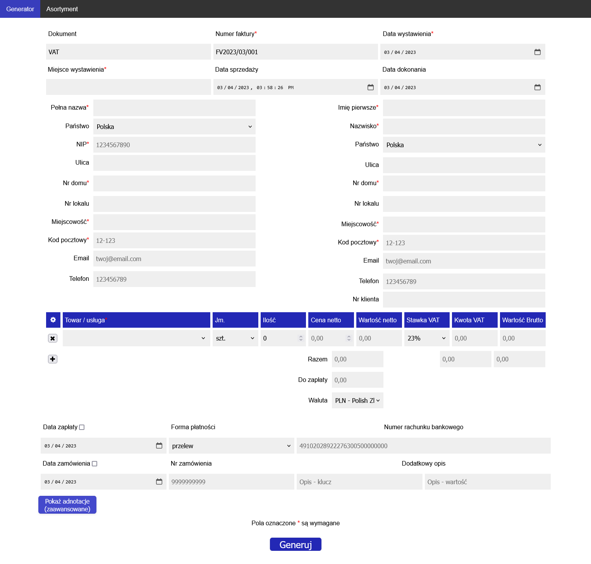
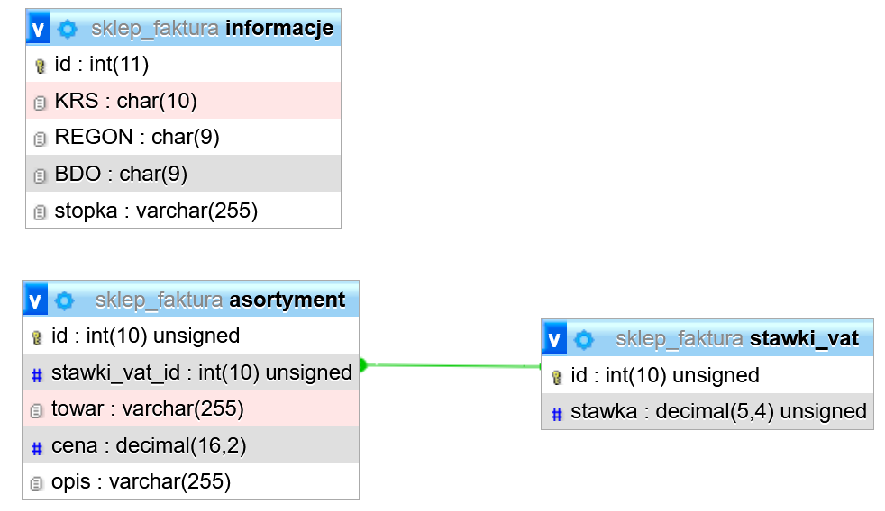
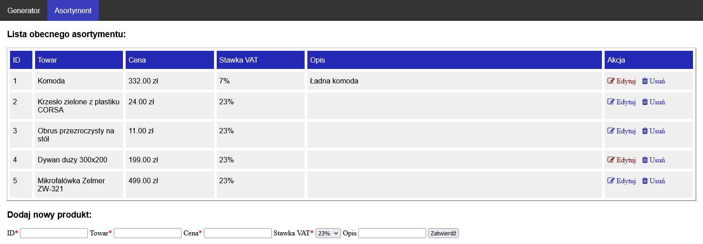

# projekt-e-Faktury-XML
Projekt: prosty generator e-Faktur, połączony z bazą danych, będącą asortymentem np. sklepu.
<p align="center">
   
</p>

## Opis
Aplikacja ma na celu generowanie faktur elektronicznych, będących plikami w formacie XML, zgodnych ze strukturą [logiczną e-Faktury FA(1)](http://crd.gov.pl/wzor/2021/11/29/11089/schemat.xsd) stworzoną przez Ministerstwo Finansów. Korzystanie z systemu e-Faktur będzie w Polsce obowiązkowe od 1 lipca 2024 roku.

Projekt został stworzony z ideą integracji z bazą danych, będącą asortymentem danego sklepu. Powinna ona zawierać ceny oferowanych produktów/usług, ich stawki VAT oraz opis. Przykładowa baza danych jest w pliku `database\sklep_faktura.sql`.
<p align="center">
   
</p>

## Użycie
Generator działa na serwerze HTTP, można skorzystać np. z [Apache](https://httpd.apache.org/) bądź [nginx](https://www.nginx.com/).
1. Stwórz bazę danych z odpowiednią strukturą.
2. Stwórz asortyment sklepu / listę usług i uzupełnij ceny oraz stawki podatkowe.
3. Uzupełnij dane faktury, korzystając z interfejsu.
4. Dodaj towary / usługi z rozwijanej listy. Opcje możliwe do wyboru pochodzą z bazy danych.
5. Opcjonalnie: zaznacz adnotacje (określone przypadki prawne). Po najechaniu na daną informacje wyświetli się opis prawny co do danej adnotacji.
6. Kliknij na przycisk **Generuj** w celu pobrania pliku XML, będącym e-Fakturą.
### Edytor asortymentu
Projekt zawiera również prosty edytor do wprowadzania produktów / usług do bazy danych, dostępny po kliknięciu na zakładkę **Asorytment** na górnym pasku.
<p align="center">
   
</p>

## Przykładowy plik e-Faktury
```xml
<?xml version="1.0" encoding="utf-8"?>
<Faktura xmlns:etd="http://crd.gov.pl/xml/schematy/dziedzinowe/mf/2021/06/09/eD/DefinicjeTypy/" xmlns:xsi="http://www.w3.org/2001/XMLSchema-instance" xmlns="http://crd.gov.pl/wzor/2021/11/29/11089/">
  <Naglowek>
    <KodFormularza kodSystemowy="FA (1)" wersjaSchemy="1-0E">FA</KodFormularza>
    <WariantFormularza>1</WariantFormularza>
    <DataWytworzeniaFa>2022-06-28T14:57:34</DataWytworzeniaFa>
    <SystemInfo>Samplofaktur</SystemInfo>
  </Naglowek>
  <Podmiot1>
    <DaneIdentyfikacyjne>
      <NIP>1234567891</NIP>
      <PelnaNazwa>ABC AGD sp. z o. o.</PelnaNazwa>
    </DaneIdentyfikacyjne>
    <Adres>
      <AdresPol>
        <KodKraju>PL</KodKraju>
        <Ulica>Kwiatowa</Ulica>
        <NrDomu>33</NrDomu>
        <NrLokalu>2</NrLokalu>
        <Miejscowosc>Poznań</Miejscowosc>
        <KodPocztowy>12-123</KodPocztowy>
      </AdresPol>
    </Adres>
    <Email>abc@abc.pl</Email>
    <Telefon>667444555</Telefon>
  </Podmiot1>
  <Podmiot2>
    <DaneIdentyfikacyjne>
      <BrakID>1</BrakID>
      <ImiePierwsze>Jan</ImiePierwsze>
      <Nazwisko>Kowalski</Nazwisko>
    </DaneIdentyfikacyjne>
    <Adres>
      <AdresPol>
        <KodKraju>PL</KodKraju>
        <Ulica>Polna</Ulica>
        <NrDomu>14</NrDomu>
        <NrLokalu>13</NrLokalu>
        <Miejscowosc>Warszawa</Miejscowosc>
        <KodPocztowy>00-001</KodPocztowy>
      </AdresPol>
    </Adres>
    <Email>jan@kowalski.pl</Email>
    <Telefon>123123123</Telefon>
    <NrKlienta>fdfd778343</NrKlienta>
  </Podmiot2>
  <Fa>
    <KodWaluty>PLN</KodWaluty>
    <P_1>2022-06-28</P_1>
    <P_1M>Warszawa</P_1M>
    <P_2>FV2022/06/000</P_2>
    <P_6>2022-06-28</P_6>
    <P_13_1>938</P_13_1>
    <P_14_1>215.74</P_14_1>
    <P_15>1153.74</P_15>
    <Adnotacje>
      <P_16>2</P_16>
      <P_17>1</P_17>
      <P_18>2</P_18>
      <P_18A>2</P_18A>
      <P_19>2</P_19>
      <P_22>1</P_22>
      <P_23>2</P_23>
      <P_PMarzy>2</P_PMarzy>
    </Adnotacje>
    <RodzajFaktury>VAT</RodzajFaktury>
    <FP>1</FP>
    <DodatkowyOpis>
      <Klucz>klucz</Klucz>
      <Wartosc>wartosc</Wartosc>
    </DodatkowyOpis>
    <FaWiersze>
      <LiczbaWierszyFaktury>4</LiczbaWierszyFaktury>
      <WartoscWierszyFaktury1>938</WartoscWierszyFaktury1>
      <FaWiersz>
        <NrWierszaFa>1</NrWierszaFa>
        <UU_ID>62bafac677c7f</UU_ID>
        <P_7>Komoda</P_7>
        <P_8A>2</P_8A>
        <P_8B>1</P_8B>
        <P_9A>332.00</P_9A>
        <P_11>332</P_11>
        <P_12>23</P_12>
      </FaWiersz>
      <FaWiersz>
        <NrWierszaFa>2</NrWierszaFa>
        <UU_ID>62bafac677c86</UU_ID>
        <P_7>Krzesło zielone z plastiku CORSA</P_7>
        <P_8A>2</P_8A>
        <P_8B>4</P_8B>
        <P_9A>24.00</P_9A>
        <P_11>96</P_11>
        <P_12>23</P_12>
      </FaWiersz>
      <FaWiersz>
        <NrWierszaFa>3</NrWierszaFa>
        <UU_ID>62bafac677c90</UU_ID>
        <P_7>Obrus przezroczysty na stół</P_7>
        <P_8A>2</P_8A>
        <P_8B>1</P_8B>
        <P_9A>11.00</P_9A>
        <P_11>11</P_11>
        <P_12>23</P_12>
      </FaWiersz>
      <FaWiersz>
        <NrWierszaFa>4</NrWierszaFa>
        <UU_ID>62bafac677c94</UU_ID>
        <P_7>Mikrofalówka Zelmer ZW-321</P_7>
        <P_8A>2</P_8A>
        <P_8B>1</P_8B>
        <P_9A>499.00</P_9A>
        <P_11>499</P_11>
        <P_12>23</P_12>
      </FaWiersz>
    </FaWiersze>
    <WarunkiTransakcji>
      <Zamowienia>
        <NrZamowienia>9999999999</NrZamowienia>
      </Zamowienia>
    </WarunkiTransakcji>
  </Fa>
  <Stopka>
    <Informacje>
      <StopkaFaktury>Kapiał zakładowy 1 000 000</StopkaFaktury>
    </Informacje>
    <Rejestry>
      <KRS>0000099999</KRS>
      <REGON>999999999</REGON>
      <BDO>000099999</BDO>
    </Rejestry>
  </Stopka>
</Faktura>
```


## Odnośniki
[Krajowy System e-Faktur](https://www.gov.pl/web/kas/krajowy-system-e-faktur)

## Licencja
[MIT](https://choosealicense.com/licenses/mit/)